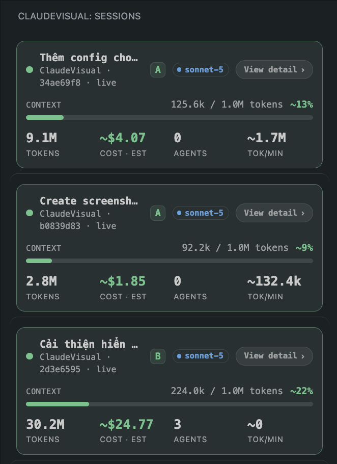
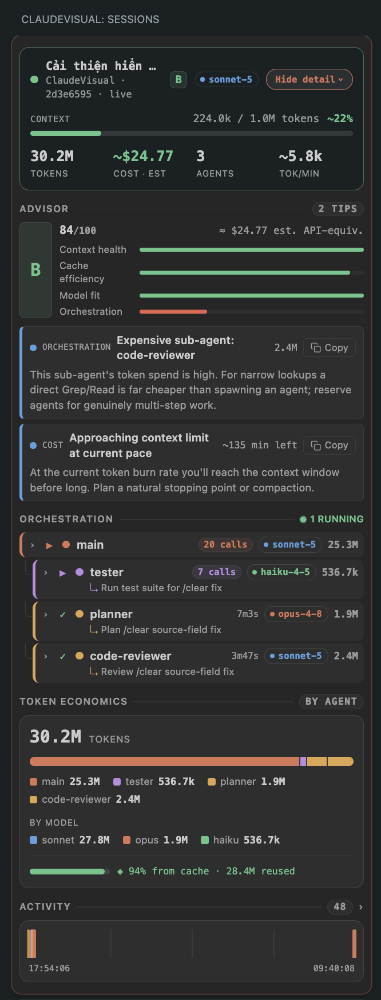

# ClaudeVisual

[](https://github.com/vietphu/claudevisual/actions/workflows/ci.yml)
[](LICENSE)

## Introduction

Real-time visibility into [Claude Code](https://claude.com/product/claude-code) sessions,
right inside VS Code — plus in-editor editing of Claude Code's own config.

While working with Claude Code from the terminal, it's hard to see at a glance: how much
context is left, which workflow/skill/sub-agent is running, which model is active, what a
task is costing in tokens, and which permission mode you're in. ClaudeVisual surfaces all of
that live in the sidebar and status bar, without slowing Claude Code down or adding to its
token/cost overhead.

## Screenshots

<table>
  <tr>
    <td width="50%" valign="top">
      
      <p align="center"><sub>Multiple concurrent sessions, each collapsed to one row (tokens, cost, context %, tok/min)</sub></p>
    </td>
    <td width="50%" valign="top">
      
      <p align="center"><sub>Session expanded — vitals, Efficiency Advisor tips, agent orchestration tree, token economics, activity timeline</sub></p>
    </td>
  </tr>
</table>

## Installation

Install "ClaudeVisual" from the
[VS Code Marketplace](https://marketplace.visualstudio.com/items?itemName=dinhphu.claudevisual),
or from the Extensions view (`Cmd+Shift+X`) by searching "ClaudeVisual".

Still on `0.x` — the settings.json safe-write path (hooks install, StatusLine wrap, config-form
writes) is unit-tested and manually walked against real sessions (see
[docs/manual-live-checklist.md](docs/manual-live-checklist.md)), but hasn't yet seen wide
multi-machine use. If it misbehaves against your `settings.json` shape, please
[open an issue](https://github.com/vietphu/claudevisual/issues) — every write goes through a
backup + atomic write-then-rename + rollback path, so worst case is an Undo, not data loss.

To build and install from source instead:

```bash
git clone https://github.com/vietphu/claudevisual.git
cd claudevisual
npm install
npm run reinstall   # builds, packages, and force-installs into your default VS Code profile
```

Then reload the VS Code window (`Cmd+Shift+P` > "Developer: Reload Window") to activate it.

See [docs/deployment-guide.md](docs/deployment-guide.md) for the full build/deploy workflow,
including the faster F5 Extension Development Host loop for active development.

## Usage

1. Open a project you use Claude Code in.
2. The ClaudeVisual sidebar (activity bar icon) and status bar populate automatically from
   that session's JSONL transcript — no configuration needed for the baseline.
3. Optionally, from the Command Palette:
   - `ClaudeVisual: Install Hooks` — appends to existing hook arrays in `settings.json` (never
     replaces them) for a lower-latency "is it running now" signal than JSONL tailing alone.
   - `ClaudeVisual: Wrap StatusLine` — wraps (never overwrites) an existing `statusLine`
     command, passing its output through unchanged, for precise context%/cost numbers.
   - `ClaudeVisual: Open Dashboard` — charts + config-editing form.

## Core values

1. **Zero overhead** — the one hard constraint the whole extension is built around: it must
   never slow down or add token/cost overhead to Claude Code itself. Every I/O surface is an
   O(1) append or an O(1) small-file overwrite — no blocking reads, no chatty hooks, no
   read-modify-write on hot paths.
2. **Visibility** — surface what the terminal hides: context left, active model, which
   skill/sub-agent is running, per-session token cost, permission mode — live, without extra
   configuration.
3. **Non-destructive, always reversible** — every write respects what's already there instead
   of overwriting it: hooks append to existing arrays, StatusLine wraps (byte-for-byte
   restorable) instead of replacing, and config writes go through backup + atomic
   write-then-rename + rollback, with Undo on every write.
4. **Actionable, not just numbers** — raw signals (tokens, cache, context %) are turned into a
   graded Efficiency Score and ranked, concrete recommendations, not just charts to stare at.

## What ClaudeVisual measures

| Signal | What it captures |
| --- | --- |
| Context window % | Usage against the active model's window limit |
| Tokens by type | Input, output, cache-creation, cache-read — totaled and broken down per sub-agent |
| Cache reuse % | Share of tokens served from cache instead of resent |
| Burn rate | Tokens/minute, used to project time-to-context-limit |
| Compaction count | How many times the session has been auto-summarized |
| Last turn stop reason | Whether the last turn was truncated (`max_tokens`) |
| Active model vs. output share | Whether the model in use matches the shape of the work |
| Per-sub-agent spend | Tokens each sub-agent consumed, relative to the main agent |

## Efficiency Score (A–F) and Advisor recommendations

The **Efficiency Score** blends four weighted 0–100 dimensions into one letter grade:

- **Context health** — full marks below the warn threshold, degrading fast past it
- **Cache efficiency** — cache reuse %, penalized further by write:read churn
- **Model fit** — penalizes only the case of a top-tier model doing low-output, read-heavy work
- **Orchestration** — penalizes a single sub-agent dominating token spend

A session with too little usage yet is scored `neutral` rather than punished for lacking data.

From those same signals, the **Advisor** raises concrete, ranked recommendations:

| Trigger | Recommendation |
| --- | --- |
| Context near/at limit | Wrap up or `/compact` now, before an auto-summary drops detail |
| High cache write:read churn | Batch edits later in the session to keep more context cached |
| Low overall cache reuse | Keep a stable prompt prefix — fewer early edits, fewer restarts |
| Repeated compaction | Split remaining work into a fresh session instead of compacting again |
| Opus doing low-output, read-heavy work | Switch to a lighter model (e.g. Sonnet) with `/model` |
| A turn stopped on `max_tokens` | Break the request into smaller steps |
| One sub-agent burned a lot of tokens | A direct Grep/Read is often cheaper than spawning an agent |
| Approaching the context limit at current burn rate | Plan a natural stopping point |

Every trigger threshold (context warn/crit %, cache churn ratio, expensive-sub-agent cap, etc.)
is configurable under `claudevisual.advisor.thresholds.*`. On a flat-fee subscription
(Max/Pro), the dollar figure is framed as an API-equivalent usage-budget proxy, not billed
money (set `claudevisual.advisor.plan`).

## Live in the UI

- **Context, per-session tokens, and burn rate** — the status bar and each session's
  collapsed sidebar row show live context %, token count, cost, and tokens/minute, fed by
  incremental updates off the JSONL transcript — no polling, no manual refresh.
- **Token economics** — a stacked bar breaks down tokens by agent, with a separate rollup by
  model and a cache-savings bar, so you can see at a glance where the spend actually went.
- **Orchestration, agent by agent** — the sidebar's agent tree shows the main session and
  every sub-agent nested by depth: type, status (running/done), model, live call count or
  elapsed duration, spawn reason, and token spend. Expanding a row drills into that agent's
  actual tool calls and the files it touched — not just an aggregate number.
- **Advisor tips as copyable prompts** — every Advisor recommendation can be copied in one
  click, pre-formatted as a prompt ready to paste straight into a Claude Code chat, so you can
  hand the optimization back to Claude Code to act on.
- **Per-session activity history** — a timeline of what happened during the session, alongside
  the files-touched panel, so past activity stays reviewable after the fact.

## Development

```bash
npm install
npm run watch        # esbuild watch mode
npm run typecheck
npm test              # unit tests (Mocha, pure functions — no VS Code runtime needed)
```

Press `F5` in VS Code to launch an Extension Development Host running the extension from
source. See [docs/deployment-guide.md](docs/deployment-guide.md) for the full dev/deploy
workflow and [docs/manual-live-checklist.md](docs/manual-live-checklist.md) for the manual
E2E checklist covering hooks, statusline wrap, and config-write/Undo behavior against a real
Claude Code session.

## Project structure

```text
src/
├── core/               # JSONL tailing, transcript parsing, session state reduction/store
├── hooks/              # Opt-in hooks + statusline wrap; safe settings.json read-modify-write
├── config/             # Settings schema, path resolution, config-writer (dual-scope)
├── ui/
│   ├── webview-view/      # Sidebar webview host-side (view provider, session view-model)
│   ├── webview-view-ui/   # Sidebar webview browser-side bundle (vitals, agent tree, advisor)
│   ├── webview/           # Dashboard host-side (panel, charts, config form)
│   └── webview-ui/        # Dashboard browser-side bundle
└── extension.ts        # Composition root
```

Full implementation plan and phase-by-phase design notes:
[plans/20260710-0900-claudevisual-vscode-extension/](plans/20260710-0900-claudevisual-vscode-extension/).

## Contributing

See [CONTRIBUTING.md](CONTRIBUTING.md).

## License

[MIT](LICENSE)

## Author

Dinh Viet Phu — [@vietphu](https://github.com/vietphu)
